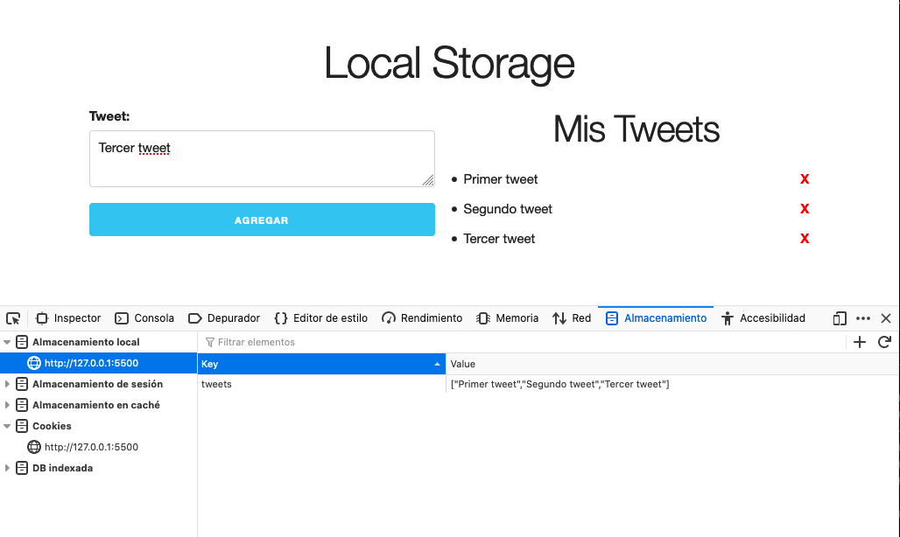

# LocalStorage

Este proyecto es para crear elementos en local storage.

Estos elementos se crear en un arreglo y al almacenar en local storage se cambia a string lo que permite crear multiples datos es una sola llave de local storage.

